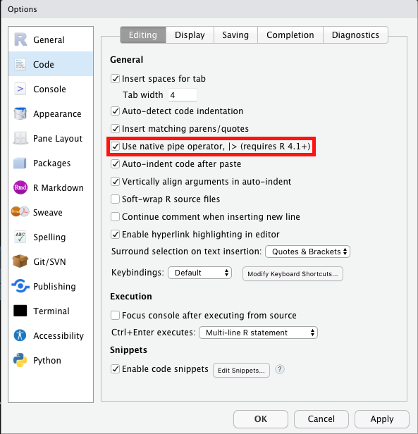

```{r,setup, include=FALSE}
library(knitr)
hook_output = knit_hooks$get('output')
knit_hooks$set(output = function(x, options) {
  # this hook is used only when the linewidth option is not NULL
  if (!is.null(n <- options$linewidth)) {
    x = knitr:::split_lines(x)
    # any lines wider than n should be wrapped
    if (any(nchar(x) > n)) x = strwrap(x, width = n)
    x = paste(x, collapse = '\n')
  }
  hook_output(x, options)
})

knitr::opts_chunk$set(cache = FALSE, message = FALSE,
                      linewidth = 50)
```

## Lecture Objectives

  - Choose the right `tidyverse` function for data transformation
    - Use the pipe operator to chain function calls

## Motivation

  - Last lecture, we used `R` to compute summary statistics.
    + We only used *base `R`*
  - But we quickly saw some limitations of this approach.
    + Summarizing by group was tedious
  - Today we will introduce the `tidyverse`, which is a suite of packages that make it easier to work with data frames
  
## Transforming your data

  - Sometimes, you want to look at a subset of the data. Or perhaps you want to compute the mean of another variable, not defined in your dataset.
    + In other words, we need to transform the data first!
  - All `tidyverse` functions take a `data.frame` as the first argument.
  - A `data.frame` is a collection of vectors, all of the same length, but could be of different types.
    + This is the main way of organizing data in `R`.
    
## `tidyverse` packages

  - The main `tidyverse` packages are:
    + `dplyr`: Main data transformation functions
    + `tidyr`: To turn your data into the tidy format (more on this later)
    + `readr`: Import data into `R`
    + `ggplot2`: Data visualization
  - All these packages can loaded by calling `library(tidyverse)`.
  - These packages are maintained by RStudio.
  - In Python, you would use Pandas for data manipulation/transformation.
  
## Main tidyverse functions {.allowframebreaks}

  - `mutate`: Create a new variable as a function of the other variables
```{r eval = FALSE}
# Switch to litres per 100km
mutate(mtcars, litres_per_100km = 235.215/mpg)
```
  - `filter`: Keep only rows for which some condition is `TRUE`
```{r eval = FALSE}
# Only keep rows where cyl is equal to 6 or 8
filter(mtcars, cyl %in% c(6, 8))
```

## Example {.allowframebreaks}

  - Let's say we want to compute a 95% confidence interval for litres per 100km.
  
```{r}
library(tidyverse)

data1 <- mutate(mtcars, litres_per_100km = 235.215/mpg)
data2 <- summarise(data1, 
                   avg_lit = mean(litres_per_100km),
                   sd_lit = sd(litres_per_100km))
data2
```

```{r}
n <- nrow(mtcars)
data3 <- mutate(data2,
                low_bd = avg_lit - 1.96*sd_lit/sqrt(n),
                up_bd = avg_lit + 1.96*sd_lit/sqrt(n))
data3
```

## Exercise

Use the `gapminder` dataset from the package `dslabs` to compute the average life expectancy across all countries for the year 2016. Compute a 95% confidence interval for this average.

## Solution {.allowframebreaks}

```{r}
library(dslabs)

data1 <- filter(gapminder, 
                year == 2016)
data2 <- summarise(data1, 
                   avg_le = mean(life_expectancy),
                   sd_le = sd(life_expectancy))
```


```{r}
n <- nrow(data1)
data3 <- mutate(data2,
                low_bd = avg_le - 1.96*sd_le/sqrt(n),
                up_bd = avg_le + 1.96*sd_le/sqrt(n))
data3
```

## Pipe operator

  - One of the important features of the `tidyverse` is the pipe operator `%>%`
  - It takes the output of a function (or of an expression) and uses it as input for the next function (or expression)

---

```{r, message = FALSE, eval = TRUE}
library(tidyverse)

count(mtcars, cyl)
```


```{r, message = FALSE, eval = FALSE}
# Or with the pipe
# mtcars becomes the first argument of count
mtcars %>% count(cyl)
```

## Pipe operator

  - In more complex examples, with multiple function calls, the pipe operator improves readability.
  
```{r eval = FALSE}
# Without pipe operator
fit_model(prepare_data(dataset))
# With pipe operator
dataset %>%
  prepare_data %>% 
  fit_model
```

## New in `R` 4.1.1

  - If you just installed or updated `R`, there is a new native pipe operator!
    + It's `|>` instead of `%>%`.
  - They are essentially equivalent, but be careful:
    + `vect %>% mean` is valid, but `vect |> mean` will throw an error.
  - You **always** need the parentheses with the native pipe.
    + `vect |> mean()`
    
## Pipe in RStudio {.allowframebreaks}

  - There is a handy shortcut for the pipe operator if you are using Rstudio:
    + `Cmd + Shift + m` on Mac
    + `Ctrl + Shift + m` on Windows/Linux
  - With the newest version of RStudio, you can choose whether to print the `tidyverse` or the native pipe.
  


## Examples {.allowframebreaks}

```{r}
# Let's convert our previous example to use the pipe
mtcars %>% 
  mutate(litres_per_100km = 235.215/mpg) %>% 
  summarise(avg_lit = mean(litres_per_100km),
            sd_lit = sd(litres_per_100km)) %>% 
  mutate(low_bd = avg_lit - 1.96*sd_lit/sqrt(n),
         up_bd = avg_lit + 1.96*sd_lit/sqrt(n))
```

  - We didn't need intermediate datasets `data1`, `data2` and `data3`.
  - It's easier to read.

## Summaries by group

  - We can combine `summarise` and `group_by` to create summaries for each group individually.
```{r eval = TRUE, message = FALSE}
# Average mpg for each value of cyl
mtcars %>% 
  group_by(cyl) %>% 
  summarise(avg_mpg = mean(mpg))
```

## Examples {.allowframebreaks}

```{r eval = TRUE, message = FALSE}
# Average mpg for each value of cyl + 95% CI
mtcars %>% 
  group_by(cyl) %>% 
  summarise(avg_mpg = mean(mpg),
            sd_mpg = sd(mpg),
            n = n()) %>% 
  mutate(low_bd = avg_mpg - 1.96*sd_mpg/sqrt(n),
         up_bd = avg_mpg + 1.96*sd_mpg/sqrt(n))
```

  - **Very important**: The number of observations in each group is different!
  - This is why we computed the number of observations in each group using the function `n()`.
  - When we compute the confidence interval, the variable `n` refers to the column `n` in the dataset, i.e. what we computed using summarise.
  - Here, the "word" `n` refers to three different things:
    + A function, `n()`, which counts the number of observations.
    + A column in the dataset that we created using the function `n()`.
    + The number of rows of `mtcars` that we computed earlier.
  - `R` keeps track of all of these (using something called "scoping rules"), but for a human this can be confusing... It's best to avoid it if we can.
  
```{r eval = FALSE, message = FALSE}
# Average mpg for each value of cyl + 95% CI
mtcars %>% 
  group_by(cyl) %>% 
  summarise(avg_mpg = mean(mpg),
            sd_mpg = sd(mpg),
            nobs = n()) %>% 
  mutate(low_bd = avg_mpg - 1.96*sd_mpg/sqrt(nobs),
         up_bd = avg_mpg + 1.96*sd_mpg/sqrt(nobs))
```

## Exercise

Compute the average life expectancy by continent for 2016 using the `gapminder` dataset. Compute 95% confidence intervals.

## Solution {.allowframebreaks}

```{r}
gapminder %>% 
  filter(year == 2016) %>% 
  group_by(continent) %>% 
  summarise(avg_le = mean(life_expectancy),
            sd_le = sd(life_expectancy),
            nobs = n()) %>% 
  mutate(low_bd = avg_le - 1.96*sd_le/sqrt(nobs),
         up_bd = avg_le + 1.96*sd_le/sqrt(nobs))
```
