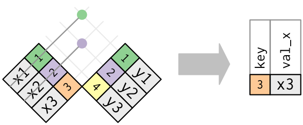

```{r setup, include=FALSE}
library(knitr)
hook_output = knit_hooks$get('output')
knit_hooks$set(output = function(x, options) {
  # this hook is used only when the linewidth option is not NULL
  if (!is.null(n <- options$linewidth)) {
    x = knitr:::split_lines(x)
    # any lines wider than n should be wrapped
    if (any(nchar(x) > n)) x = strwrap(x, width = n)
    x = paste(x, collapse = '\n')
  }
  hook_output(x, options)
})

knitr::opts_chunk$set(cache = FALSE, message = FALSE,
                      linewidth = 50)

library(tidyverse)
glimpse <- purrr::partial(glimpse, width = 50)
```

## Lecture Objectives

  - Understand the difference between the different types of joins
  - Be able to choose and select the appropriate mutating join or filtering join

## Motivation

  - In the last lecture, we discussed the tidy data framework.
  - Recall: each observational unit should be in its own dataset.
    + For easier maintenance
  - Today we will learn how to recombine each dataset for analysis/visualization etc.

## Relational data {.allowframebreaks}

  - So far we've looked at data that fits neatly into a `data.frame`.
    + Each row is an observation, and for each observation we collected the **same** variables.
  - This is not the only way to store data. Let's look at an example: university course enrollment data.
    + For every student we need to collect personal information. 
    + For every course we need to collect specific information.
  - Clearly these datasets should be separate; you can think of them as two different `data.frame`s.
  - **Question**: How should we store information about which courses students are taking?
  - Should we add the name of courses to the student `data.frame` as new variables? How many variables should we create?
  - Should we add the name of students to the course `data.frame` as new variables? How many variables should we create?
  - **A better solution**: Create a *new* dataset, where each row corresponds to a pair (student, course).
  - **Why does this work?** Each student has a **unique** identifier, and so does each course. 
  
\vspace{1cm}
  
  - To create a class list:
    + Filter the (student, course) `data.frame` to only keep pairs for a given course.
    + Look up which students appear in the filtered dataset
    + Keep relevant personal information (e.g. student number, major, degree)
  - The process of "looking up" is called a **mutating join**.
  
## Example {.allowframebreaks}

  - This dataset is separated into two CSV files:
    + One contains a list of 2,410 US craft beers
    + The other contains data on 510 US breweries
  - The beers and breweries datasets have a variable in common, called `brewery_id`. 

```{r message = FALSE}
library(tidyverse)

df_beers <- read_csv("beers.csv")
df_breweries <- read_csv("breweries.csv")

glimpse(df_beers)
glimpse(df_breweries)
```

## Mutating joins

  - **Mutating joins** create a new dataset by combining two datasets and respecting their relationship.
    + This relationship is encoded by a common variable (or set of variables), often a unique identifier.
  - The main idea is as follows:
    + Take a row from the first dataset
    + Find a matching row in the second dataset
    + Create a new row by concatenating the two rows
  - The different types of mutating joins differ in how they handle cases with no matches.

## Inner join

  - In inner joins, we only create a new row if we can match rows from both datasets.

<center>

</center>

## Example {.allowframebreaks}

```{r}
library(tidyverse)

dataset <- inner_join(df_beers,
                      df_breweries,
                      by = "brewery_id")
glimpse(dataset)
```

```{r}
# dataset and df_beers have the same # of rows
nrow(dataset) == nrow(df_beers)
# dataset has one less than the sum of # cols
c(ncol(dataset), ncol(df_beers), ncol(df_breweries))
```

## Exercise

<center>
Find the state with the highest average of alcohol by volume (`abv`) per beers.
</center>

## Solution {.allowframebreaks}

  - Now that the datasets are joined, we can use `group_by` and `summarise`.

```{r}
# Careful about missing values!
dataset %>% 
  group_by(state) %>% 
  summarise(avg_abv = mean(abv, na.rm = TRUE)) %>% 
  filter(avg_abv == max(avg_abv))
```

## Left/right join {.allowframebreaks}

  - But what if we want to keep rows from a dataset that don't have a matching row in the other dataset?
  - Left and right (outer) joins will do just that and replace the non-matching row with `NA`s.
  - Left and right refer to the dataset from which we want to keep rows.
    + `left_join(x, y)` will keep rows of `x`
    + `right_join(x, y)` will keep rows of `y`

<center>

</center>

## Example {.allowframebreaks}

```{r}
library(nycflights13)

# Information about flights
glimpse(flights)
# Information about airplanes
glimpse(planes)
```

```{r}
# How many flights? How many planes?
c(nrow(flights), nrow(planes))

# How many flights have matching plane?
inner_join(flights, planes, by = "tailnum") %>% 
  nrow
```

```{r}
# With left_join, we keep all flights
left_join(flights, planes, by = "tailnum") %>% 
  glimpse
```

## Full join

 - The full join allows us to keep unmatched rows from **both** datasets.

<center>

</center>

## Exercise

<center>
The `flights` dataset contains information about departure and arrival delays (`dep_delay` and `arr_delay`). Compute the average delays for each manufacturing year (i.e. the year the plane was manufactured).
</center>

## Solution {.allowframebreaks}

```{r}
# First we combine the two datasets 
# and create tot_delay variable
# Note: Could also use inner_join
dataset <- left_join(flights,        
                     planes,
                     by = "tailnum") %>% 
  mutate(tot_delay = dep_delay + arr_delay)
```

```{r error = TRUE}
# Next group by year and summarise
data_avg <- dataset %>% 
  group_by(year) %>% 
  summarise(avg_delay = mean(tot_delay, na.rm = TRUE))
```

```{r}
# What happened?
# Both flights and planes have a variable year
# year.y refers to the one from planes
names(dataset)
```

```{r}
# Try again
data_avg <- dataset %>% 
  group_by(year.y) %>% 
  summarise(avg_delay = mean(tot_delay, na.rm = TRUE))
```

## Filtering joins

  - The starting point is still the same:
    + We have two `data.frame`s `x` and `y`
    + They have a variable in common that allows us to match rows across
  - In filtering joins, we want to filter the rows of `x` based on their relationship with the rows of `y`.
    + In particular, the output of a filtering join is a *subset* of `x`.
  
## Semijoin

  - In a **semijoin**, we only keep the rows of `x` with a corresponding match in `y`
  
<center>

</center>

## Example {.allowframebreaks}

```{r message = FALSE}
library(tidyverse)

df_beers <- read_csv("beers.csv")
df_breweries <- read_csv("breweries.csv")
```

```{r}
# Top 5 states for # breweries
state_top5 <- df_breweries %>% 
  count(state) %>% 
  top_n(5)
```


```{r}
state_top5
```


```{r}
breweries_top5 <- semi_join(df_breweries,
                            state_top5)
```


```{r}
breweries_top5
```

```{r}
# Only keep beers from these states
semi_join(df_beers,
          breweries_top5,
          by = "brewery_id") %>% 
  count(style, sort = TRUE)
```

## Antijoin

  - In an **antijoin**, we only keep the rows of `x` *without* a corresponding match in `y`
  
<center>

</center>

## Example {.allowframebreaks}

```{r}
# Let's look at the other states
breweries_nottop5 <- anti_join(df_breweries,
                               state_top5)
```


```{r}
breweries_nottop5
```

```{r}
# Only keep beers from these states
semi_join(df_beers,
          breweries_nottop5,
          by = "brewery_id") %>% 
  count(style, sort = TRUE)
```

## Exercise

<center>
Filter the dataset `flights` from the `nycflights13` package to only show flights with planes that have flown at least 100 flights.
</center>

## Solution {.allowframebreaks}

```{r}
library(nycflights13)

planes100 <- flights %>% 
  count(tailnum) %>% 
  filter(n >= 100)
```

```{r}
flights100 <- semi_join(flights,
                        planes100)
```

```{r}
# Do we get flights with missing
# tail number?
flights100 %>% 
  filter(is.na(tailnum)) %>% 
  nrow
```

```{r}
# We can remove these NAs from planes100
planes100 <- filter(planes100,
                    !is.na(tailnum))
# Or we can remove them from flights100
flights100 <- filter(flights100,
                     !is.na(tailnum))
```

## Some tips about joins

  - You can join using more than one variable:
  
```{r eval = FALSE}
inner_join(x, y, by = c("var1", "var2"))
```

  - You can join even when the same variable is named differently:
  
```{r eval = FALSE}
inner_join(x, y, by = c("name1" = "name2"))
```


## Set operations {.allowframebreaks}

  - Here, the setup is slightly different.
    + We still have two `data.frame`s `x` and `y`.
    + But we assume they have **exactly** the same variables.
  - We want to create a new dataset `z` that will also have the same variables as `x` and `y`.
  - There are three different set operations:
    + **Union**: `z` has the unique observations from `x` and `y`.
    + **Intersection**: `z` has the observations common between `x` and `y`.
    + **Set difference**: `z` has the observations from `x` that are not in `y`.
    
```{r message = FALSE}
library(tidyverse)
df1 <- tibble(
  x = c(1, 2),
  y = c(1, 1)
)
df2 <- tibble(
  x = c(1, 1),
  y = c(1, 2)
)
```

```{r}
# Note that we get 3 rows, not 4
# because of duplicates
union(df1, df2)
```


```{r}
intersect(df1, df2)
```

\vspace{2cm}

```{r}
setdiff(df1, df2)
```

\vspace{2cm}

```{r}
# The order is important!
setdiff(df2, df1)
```

## Summary

  - Not all data is neatly packaged into CSV files.
  - Often the data we need is spread over multiple datasets.
  - If these datasets have a matching variable, we can create a new dataset with matching rows using **mutating joins**.
  - Choosing between an inner join, left/right join or full join depends on what we want to do with unmatched rows.
    + Do we keep all of them? Only those from one of the two datasets?
