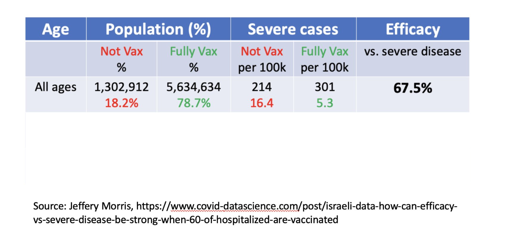
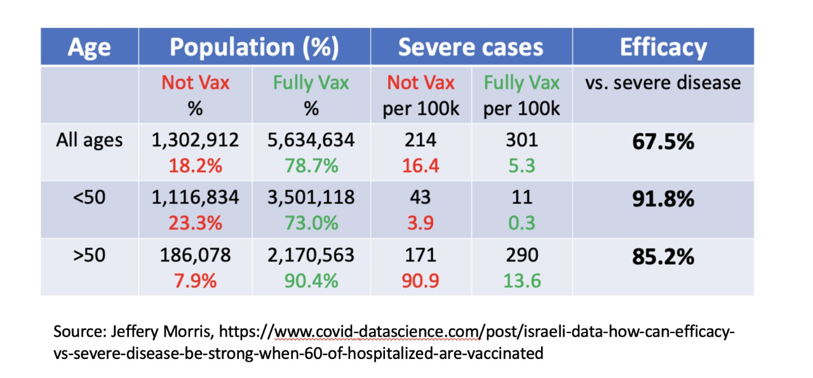

```{r,setup, include=FALSE}
library(knitr)
hook_output = knit_hooks$get('output')
knit_hooks$set(output = function(x, options) {
  # this hook is used only when the linewidth option is not NULL
  if (!is.null(n <- options$linewidth)) {
    x = knitr:::split_lines(x)
    # any lines wider than n should be wrapped
    if (any(nchar(x) > n)) x = strwrap(x, width = n)
    x = paste(x, collapse = '\n')
  }
  hook_output(x, options)
})

knitr::opts_chunk$set(cache = FALSE, message = FALSE,
                      linewidth = 50)
```

## Israel COVID Vaccine Data



## Israel COVID Vaccine Data Redux



## What is going on?

  - Vaccination and severity are not uniform over age groups.
    + Most unvaccinated people are < 50 years old.
    + Most severe events occur in people who are > 50 years old.
  - When stratifying by age, we see good vaccine efficacy.
  
## Simpson's Paradox

  - **Simpson's Paradox** refers to situations where we see an effect (e.g. vaccine efficacy) in subgroups, but the effect disappears, or attenuates, in aggregate.
  - This paradox can be resolved by careful *interpretation* and *modeling* of the data.
    + In the example above, to accurately model the effect of vaccines, we need to include age in our analysis.
  