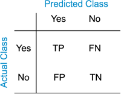
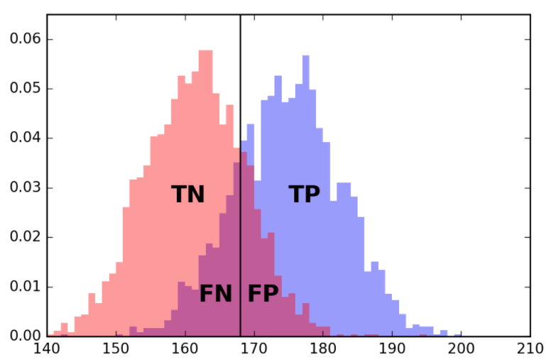

```{r,setup, include=FALSE}
library(knitr)
hook_output = knit_hooks$get('output')
knit_hooks$set(output = function(x, options) {
  # this hook is used only when the linewidth option is not NULL
  if (!is.null(n <- options$linewidth)) {
    x = knitr:::split_lines(x)
    # any lines wider than n should be wrapped
    if (any(nchar(x) > n)) x = strwrap(x, width = n)
    x = paste(x, collapse = '\n')
  }
  hook_output(x, options)
})

knitr::opts_chunk$set(cache = FALSE, message = FALSE,
                      linewidth = 50)
```

## Lecture Objectives

  - Understand the difference between training and test data.
  - Describe the workflow of model evaluation.
  - Compute the different metrics used in model evaluation.

## Motivation

  - After building a model, you should probably ask yourself **is it any good**?
    + Or **could you improve it**?
    + Or given two models, **which one is the best**?
  - In this lecture, we will discuss strategies for validating and evaluating a model.
  - These ideas will be important for the rest of the semester, when we actually start building models!
  
## Basic setup {.allowframebreaks}

  - Models typically have parameters that need to be estimated.
    + E.g. regression coefficients in linear regression; decision rules in classification trees.
  - With data-driven models, we learn (or estimate) these parameters using data.
    + This dataset is called the **training dataset**.
  - Some models are very expressive and do a great job of describing the training data.
  - But what we want is to apply the model to *new data*.
  - Therefore, when we evaluate models, we want to do it on a separate dataset.
    + This separate dataset is called the **test dataset**.
  - The workflow is as follows:
    + Train model on *training data*.
    + Validate/evaluate on *test data*.
    + When changing the model, go back to the *training data*.
  - **Note**: there is always a risk of being overconfident in our model if we look at the test data.
    + You could implicitly or explicitly start optimizing for the test data...
  - Best practice: build several models using the training data, then evaluate all at the same time.

## Classification vs Regression

  - We will discuss several ways to evaluate models.
  - These metrics usually depend on the task at hand.
  - **Classification**: The model outputs a class label (e.g. cats, dogs, birds, etc.)
  - **Regression**: The model outputs a numerical value (e.g. predicted value of stock, probability of rain, etc.)
  
## Evaluating Classifiers

  - Correct vs Incorrect classification for binary classifiers:
  

  
  - This is sometimes called a **confusion matrix**.
  
## Threshold classifiers {.allowframebreaks}

  - Some classifiers are built by taking a *score* and using a threshold:
    + If the score is greater than threshold, then classify as positive.
    + If the score is lower than threshold, then classify as negative.
  - To choose a threshold, we would want to maximize the number of TPs and TNs, while minimizing the number of FPs and FNs.
    + On the test data!
    


## Accuracy

  - **Accuracy** is the ratio of correct predictions over total predictions:
  
$$\mathrm{Accuracy} = \frac{TP + TN}{TP + FP + FN + TN}.$$

  - In balanced datasets (i.e. same number of observations in each class), randomly guessing will have an accuracy of 50%.
  - In highly unbalanced datasets (e.g. 95% of observations are from a single class), then always guessing the majority class will lead to high accuracy...

## Precision

  - Also called **Positive Predictive Value**: proportion of correct calls among the positive calls.
  
$$\mathrm{Precision} = \frac{TP}{TP + FP}.$$

  - In medicine: probability of having the disease, given that the test was positive.
  
## Exercise

Assume we have 100 observations: 90 are negative and 10 are positive. What would be the accuracy and the precision of:

  - Someone making random guesses (with equal probability for each class)?
  - Someone always guessing positive?
  
## Solution {.allowframebreaks}

Let's start with random guesses: 

  - out of the 90 negative observations, we would expect 45 would be TNs and 45 would be FPs.
  - out of the 10 positive observations, we would expect 5 would be TPs and 5 would be FNs.
  
\begin{align*}
\mathrm{Accuracy} &= \frac{TP + TN}{TP + FP + FN + TN} &= \frac{50}{100} &= 50\%,\\
\mathrm{Precision} &= \frac{TP}{TP + FP} &= \frac{5}{50} &= 10\%.
\end{align*}

\vspace{1cm}

Now let's consider all positive guesses: 

  - out of the 90 negative observations, we would expect 0 would be TNs and 90 would be FPs.
  - out of the 10 positive observations, we would expect 10 would be TPs and 0 would be FNs.
  
\begin{align*}
\mathrm{Accuracy} &= \frac{TP + TN}{TP + FP + FN + TN} &= \frac{10}{100} &= 10\%,\\
\mathrm{Precision} &= \frac{TP}{TP + FP} &= \frac{10}{100} &= 10\%.
\end{align*}

What would happen to precision if someone always guesses negative?

## Recall

  - Also called **Sensitivity** and **hit rate**: proportion of correct calls among the positive observations.
  
$$\mathrm{Recall} = \frac{TP}{TP + FN}.$$

  - Don't confuse this with precision, even if they look similar. Think of conditional probabilities.
  - Someone always guessing positive will have perfect recall...

## F-score

  - The **F-score** is a way to balance precision and recall.
  
$$\mbox{F-score} = 2\frac{\mathrm{Precision}\cdot \mathrm{Recall}}{\mathrm{Precision} + \mathrm{Recall}}.$$

  - The F-score is actually the *harmonic mean* of precision and recall.
    + And the harmonic mean is always less than or equal to the (usual) arithmetic mean.
    
## Exercise

Given the same setting as the previous exercise, compute the recall and F-score for the two classifiers.

## General comments

  - Accuracy is generally misleading with unbalanced test data.
  - High precision is difficult to achieve with unbalanced test data.
    + Even minimal error can lead to a large number of FPs.
  - The F-score is a good way to balance all these things.
  - **Recommendation**: Compute and report all metrics.
  
## Evaluating Regression Models

  - In regression problems, for each observation in the test data, we will have
    + A predicted value, coming from the model.
    + An actual/observed value, coming from the test data.
  - In evaluating a regression model, we want to assess how *close* the predicted values are to the observed values.
    + Think distance metrics.
    
## Numerical Errors {.allowframebreaks}

  - We will use $f_i$ for the $i$-th predicted (or forecasted) value, and $o_i$ for the corresponding observed value.
  - **Mean Squared Error**: Average of squared differences:
  
$$ \mathrm{MSE} = \frac{1}{n}\sum_{i=1}^n \left(f_i - o_i\right)^2.$$

  - The RMSE is the square root of the MSE.
    + And it is on the same scale as the observations, so easier to interpret.

\vspace{1cm}

  - **Mean Absolute Error**: Average of absolute differences:
  
$$ \mathrm{MAE} = \frac{1}{n}\sum_{i=1}^n \left\lvert f_i - o_i\right\rvert.$$

  - **Mean Absolute Percentage Error**: Average of absolute *relative* differences:
  
$$ \mathrm{MAPE} = \frac{1}{n}\sum_{i=1}^n \left\lvert \frac{f_i - o_i}{o_i}\right\rvert.$$

\vspace{1cm}

  - MAPE is typically reported on the percentage scale.
    + Easier to interpret over multiple scale/problems, but can run into problems with small observed values.

## Example {.allowframebreaks}

  - We will use the famous prostate cancer dataset.
  
```{r}
url <- paste0("https://web.stanford.edu/~hastie/",
              "ElemStatLearn/datasets/prostate.data")
data <- read.table(url)

names(data)
```

```{r}
# Separate train and test
library(tidyverse)
count(data, train)

data_train <- filter(data, train)
data_test <- filter(data, !train)
```

  - We will build a simple regression model for predicting the log-PSA value (`lpsa`): 
    + We always predict the sample mean from the training data.
  - We will look at better models in the next lectures.
    
```{r}
prediction <- data_train |> 
  pull(lpsa) |> 
  mean(na.rm = TRUE)

prediction
```

```{r}
# Now compute metrics----
actual_vals <- pull(data_test, lpsa)
# MSE
mse <- mean((actual_vals - prediction)^2)
rmse <- sqrt(mse)

c(mse, rmse)
```

```{r}
# MAE
mae <- mean(abs(actual_vals - prediction))
mae
```

```{r}
# MAPE
ratios <- (actual_vals - prediction)/actual_vals
mape <- 100*mean(abs(ratios))
mape
```

```{r}
# All together
c(mse, rmse, mae, mape)
```

  - MAPE is the only one we can interpret without more context.
