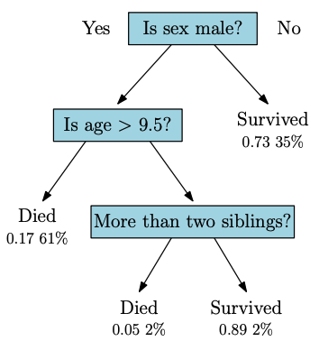
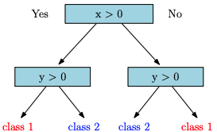

```{r,setup, include=FALSE}
library(knitr)
hook_output = knit_hooks$get('output')
knit_hooks$set(output = function(x, options) {
  # this hook is used only when the linewidth option is not NULL
  if (!is.null(n <- options$linewidth)) {
    x = knitr:::split_lines(x)
    # any lines wider than n should be wrapped
    if (any(nchar(x) > n)) x = strwrap(x, width = n)
    x = paste(x, collapse = '\n')
  }
  hook_output(x, options)
})

knitr::opts_chunk$set(cache = FALSE, message = FALSE,
                      linewidth = 50)
```

## Lecture Objectives

  - Explain the decision tree algorithm.
  - Fit decision trees in Python.
  - Evaluate the model using different metrics.

## Motivation

  - Last lecture, we discussed nearest neighbour classifiers.
    + Simple and sometimes powerful.
  - To improve flexibility, we had to let go of interpretability.
    + We can't really tell which predictors are important.
  - **Decision trees** are also very flexible, but they are more interpretable.

## Decision Tree Classifiers {.allowframebreaks}

  - Let's consider the Titanic dataset, which contains several predictors:
    + Age and sex, how many siblings/parents a passenger had, which class they were in, whether they survived, etc.
  - Given our knowledge of this tragedy, we can guess which variables are most important in predicting survival.
    + Women and children were more likely to survive.
    + First and second class were more likely to survive than third class and the crew.
    + Etc.
  - These guesses could be encoded in a **decision tree**.
  


  - Decision trees are binary trees (i.e. each node splits into two branches).
  - Each node corresponds to a predicate (i.e. something that is either TRUE or FALSE) involving a *single* predictor.
  - Each leaf corresponds to a single class.
  - Starting from the root (i.e. the first node), we classify an observation by evaluating each predicate in succession until we reach a leaf. The class associated with this leaf is the prediction.

## Properties

  - Decision trees are really easy to interpret.
  - They can model complex relationships between the target and the features.
  - They easily account for categorical variables.
    + Ordinal (e.g. "Was the customer somewhat or extremely satisfied?")
    + Nominal (e.g. "Is the blood type A+ or A-?")

## Non-Linear Relationships {.allowframebreaks}

  - Consider the following picture of a binary classification with two features.
  - The data appears in four clusters, in each of the four quadrants of the plane, with opposite quadrants representing the same class.
    + This is also known as the *Exclusive OR* (XOR) classification problem.
  
```{r echo = FALSE, warning = FALSE}
library(mvtnorm)
library(purrr)
library(tidyverse)

n <- 100
mean_vec <- list(c(2, 2), c(2, -2), c(-2, -2), c(-2, 2))

dataset <- map_df(mean_vec, \(mean) {
    data <- as_tibble(rmvnorm(n, mean = mean))
    names(data) <- c("X", "Y")
    mutate(data, class = sign(prod(mean)))
})

dataset |> 
    filter(sign(X * Y) == class) |> 
    mutate(class = factor(class, levels = c(1, -1))) |> 
    ggplot(aes(x = X, y = Y, 
               colour = class)) +
    geom_point()
```

  - There is no way to draw a line that will perfectly classify this dataset.
  - Similarly, logistic regression will also fail.
  - On the other hand, it is very easy to construct a decision tree with perfect classification.
  


  - In fact, decision trees are known to be **universal approximators**, meaning they can approximate any smooth function to an arbitrary level of precision.
    + But keep in mind the bias-variance trade-off!
    
## Fitting decision trees

  - You can certainly build a decision tree from first principles.
    + Very common in medical sciences.
  - But this is a data science course, so we will build them using training data.
  - The general idea is to create a tree where each leaf is as pure as possible.
    + I.e. the only training data points reaching a given leaf have the same class.
  - At the same time, we want to create balanced trees.
    + I.e. when we split a node, there should roughly be the same number of observations in each branch.
  - We will quantify these two concepts using **entropy** and **information gain**.

## Entropy {.allowframebreaks}

  - Let $S$ be the subset of data at a particular node. 
  - Let $f_k$ be the proportion of observations in $S$ that are of class $C_k$, for $k=1,\ldots,K$.
  - The entropy is defined as
  
$$H(S) = -\sum_{k=1}^K f_k \log(f_k).$$

  - **Note**: Different applications use different bases for the logarithm. We will use the natural logarithm, as is common in statistics.
  - A few observations:
    + Since $f_k \leq 1$, we have $\log(f_k) \leq 0$, which means $H(S) \geq 0$. 
    + If $f_k =0$ or $f_k=1$, we have $f_k \log(f_k) = 0$. Therefore, if all observations are in a single class, we have $H(S) = 0$.
    + If all observations are equally distributed among the $K$ classes, we have the following result:
    
\begin{align*}
H(S) &= -\sum_{k=1}^K f_k \log(f_k)\\
    &= -\sum_{k=1}^K \frac{1}{K} \log\left(\frac{1}{K}\right)\\
    &= \log\left(K\right).\\
\end{align*}

  - In decision trees, we want to minimize the entropy at each node.

## Exercise

Assume we have 13 positive and 87 negative observations. Compute the entropy of this dataset, and compare it to the maximum entropy for two classes.

## Solution

```{r}
props <- c(13/100, 87/100)

-sum(props * log(props))

# Compare to maximum
log(2)
```

## Information Gain

  - The goal is therefore to find a predicate $p$ that will maximize the drop in entropy.
  - Suppose $p$ separates the set $S$ into two disjoint sets $S_1,S_2$. 
  - We define the **information gain** as follows:
  
$$IG_p(S) = H(S) - \sum_{j=1}^2\frac{\lvert S_j\rvert}{\lvert S\rvert} H(S_j).$$

  - For each node, we look through **all** potential predicates to find the one that maximizes the information gain. That predicate is then used to split the node.
  
## Exercise

Assume our 13 positive and 87 negative observations can be further broken down as follows:

|        | Positive | Negative |
|--------|----------|----------|
| Male   |    8     |    22    |
| Female |    5     |    65    |

What is the information gain when splitting the dataset using the covariates "Sex"?

## Solution {.allowframebreaks}

```{r}
props <- c(13/100, 87/100)
props_m <- c(8/30, 22/30)
props_f <- c(5/70, 65/70)

entropy_full <- -sum(props * log(props))
entropy_male <- -sum(props_m * log(props_m))
entropy_fem <- -sum(props_f * log(props_f))

c(entropy_full, entropy_male, entropy_fem)
```

```{r}
entropy_full - (29/100)*entropy_male - 
    (71/100)*entropy_fem
```

## Stopping Rule

  - We now have a way to grow a tree:
    + At each leaf, choose the predicate that maximizes the information gain.
  - But we also need a **stopping rule**: when do we stop growing the tree?
  - There are two main strategies:
    + Fix a tolerance level $\epsilon > 0$. If you can't find a predicate with information gain $IG_p(S) > \epsilon$, stop growing the tree.
    + Fix a positive integer $D$. Stop growing the tree once you've reached a depth $D$ or if each leaf is pure (i.e. all observations from the same class).
  - In practice, people usually use the second approach, and then prune the tree using another algorithm (details omitted).

## Regression Trees

  - Trees can also be used for regression.
  - **Main idea**: Use the average outcome of all training observations at a leaf as the predicted value.
  - Instead of maximizing the information gain, we look for a predicate that minimizes the Sum of Squares of Errors (SSE).
  
$$ SSE = \sum_{y \in S_1} (y - \bar{y}_1)^2 + \sum_{y \in S_2} (y - \bar{y}_2)^2,$$

where $\bar{y}_j$ is the average outcome for the training observations in the subset $S_j$.

## Final Comments

  - Other splitting criterion can be used, and none are optimal.
    + Gini impurity, variance reduction, positive correctness, etc.
  - Small trees may miss important aspects of the data, while large trees may overfit.
    + Bias-variance trade-off!
  - When we have many covariates, finding the optimal predicate can be computationally expensive.
    + Same thing if a categorical variable has many levels.
  - Two general strategies can be used to address these issues:
    + Bagging (next lecture)
    + Boosting
    