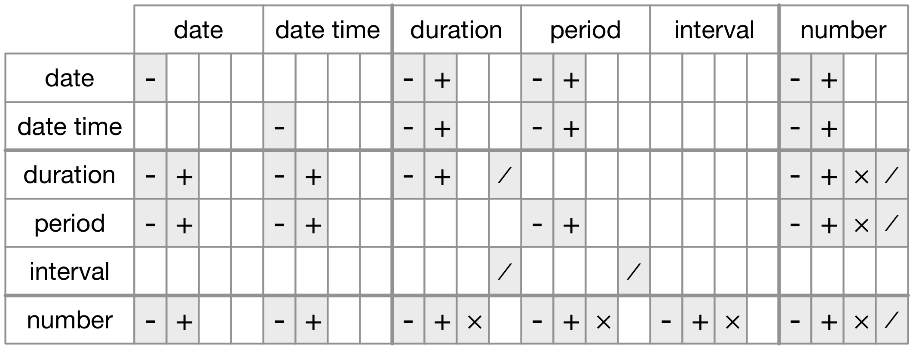

```{r,setup, include=FALSE}
library(knitr)
library(lubridate)
hook_output = knit_hooks$get('output')
knit_hooks$set(output = function(x, options) {
  # this hook is used only when the linewidth option is not NULL
  if (!is.null(n <- options$linewidth)) {
    x = knitr:::split_lines(x)
    # any lines wider than n should be wrapped
    if (any(nchar(x) > n)) x = strwrap(x, width = n)
    x = paste(x, collapse = '\n')
  }
  hook_output(x, options)
})

knitr::opts_chunk$set(cache = FALSE, message = FALSE,
                      linewidth = 50)
```

## Lecture Objectives

  - Describe how dates and times can be a challenging data type
  - Use the `lubridate` package to manipulate dates

## Motivation

  - Dates and times are notoriously difficult to program with.
    + How many days in a year?
    + How many hours in a day? How do you account for Daylight Savings?
    + How many seconds in a minute? What about leap seconds?
  - Time zones can also be confusing.
    + Not every time zone follows DST
    + Some time zones are a half-hour away from another (e.g. America/St. John's)
  - The `lubridate` package can make all this much easier.
  
## Creating date  and date-time objects {.allowframebreaks}

  - We will often find dates in datasets
    + E.g. enrollment date, birthday, etc.
  - However, these are often written in different formats.
    + E.g. 2021/09/17, September 17th 2021
  - `lubridate` has three functions that can parse dates from strings if you specify the order of day (`d`), month (`m`), year (`y`).
  
```{r}
library(lubridate)
ymd("2017-01-31")
mdy("January 31st, 2017")
dmy("31-Jan-2017")
```

  - Similarly, if you also have time information, `lubridate` can parse the string if you specify hour (`h`), minute (`m`), second (`s`).
  
```{r}
ymd_hms("2017-01-31 20:11:59")
mdy_hm("01/31/2017 08:01")
```

  - Some datasets will also contain each separate component.
  
```{r}
library(tidyverse)
library(nycflights13)

flights %>% 
  select(year, month, day, hour, minute)
```

```{r}
flights %>% 
  select(year, month, day, hour, minute) %>% 
  mutate(departure = make_datetime(year, month, day, 
                                   hour, minute))
```

  - Finally, you can also specify a date or date-time as an offset in days or seconds with respect to the "Unix Epoch", which is January 1st 1970.
  
```{r}
# Offset in seconds
as_datetime(60 * 60 * 10)
# Offset in days
as_date(365 * 10 + 2)
```

## Exercises

  1. What happens if you run the following code?
  
```{r eval = FALSE}
ymd(c("2010-10-10", "bananas"))
```

  2. Look at the help page for the function `today`. What does `tzone` argument do?
  3. Convert each of the following strings to date objects:
  
```{r}
d1 <- "January 1, 2010"
d2 <- "2015-Mar-07"
d3 <- "06-Jun-2017"
d4 <- c("August 19 (2015)", "July 1 (2015)")
d5 <- "12/30/14" # Dec 30, 2014
```

## Solutions {.allowframebreaks}

### Exercise 1

```{r eval = TRUE}
ymd(c("2010-10-10", "bananas"))
```

We can the value `NA` and `R` prints a warning.

### Exercise 2

The argument `tzone` changes the time zone in which the date is printed. This could potentially give us tomorrow's date if we take a different time zone (e.g. `tzone = "Pacific/Auckland"`).

### Exercise 3

```{r}
mdy("January 1, 2010")
ymd("2015-Mar-07")
```

### Exercise 3 (cont'd)

```{r}
dmy("06-Jun-2017")
mdy(c("August 19 (2015)", "July 1 (2015)"))
mdy("12/30/14")
```

## Date-time components

  - `lubridate` provides functions to extract components from dates
    + `year()`, `day()`, `second()`, etc.
  - Two interesting components:
    + `month()`: Can output either the number or name of the month.
    + `wday()`: Can output either the number of name of the day of the week.
    
## Examples

```{r}
month(today(), label = TRUE)

wday(now(), label = TRUE, abbr = FALSE)
```

## Date-time arithmetic {.allowframebreaks}

```{r}
# Simple arithmetic
today() + years(1)
today() + weeks(4)
```

\vspace{1in}

```{r}
# But be careful! 
ymd("2021/01/31") + months(1)
```

  - Notice the difference between `year()`, which extracts the year component, and `years()`, which adds (or subtracts) years from a given date.
  - We can also round a date up or down to the nearest year, month, etc.
  
```{r}
ceiling_date(today(), unit = "month")
floor_date(today(), unit = "year")
```

## Time spans {.allowframebreaks}

  - The package `lubridate` measures time spans in three different ways:
    + **durations**, which represent an exact number of seconds.
    + **periods**, which represent human units like weeks and months.
    + **intervals**, which represent a starting and ending point.
  - Functions like `months()` and `years()` refer to *periods*.
  - *Durations* can be constructed using the following functions
    + `dseconds()`, `ddays()`, `dweeks()`, etc.
  
```{r}
# Careful: durations are an exact number of seconds!
one_pm <- ymd_hms("2016-03-12 13:00:00", 
                  tz = "America/New_York")

one_pm
one_pm + ddays(1)
```

  - Notice the change in time zones.
  - Finally, *intervals* have a starting and an ending time point.
    + They can be constructed from two date-time objects using the operator `%--%`
    
```{r}
next_year <- today() + years(1)
today() %--% next_year
```

  - You can also determine how many *durations* fall inside an *interval* using division.
  
```{r}
(today() %--% next_year)/ddays(1)
(today() %--% next_year)/dweeks(1)
```



Permitted arithmetic operations between the different data types (*R for Data Science*).

## Exercises

  1. Create a vector of dates giving the first day of every month in 2015.
  2. Create a vector of dates giving the first day of every month in the current year (your code should also work after January 1st).
  3. Write a function that given your birthday (as a date), returns how old you are in years.
  
## Solutions {.allowframebreaks}

### Exercise 1

```{r}
ymd("20150101") + months(0:11)
```

### Exercise 2

The main difference is that we need to start at January 1st of the current year. We can  round down today's date.

```{r}
floor_date(today(), unit = "years") + months(0:11)
```

### Exercise 2 (cont'd)

```{r}
# Also valid
first_day <- ymd(paste0(year(today()), "0101"))
first_day + months(0:11)
```

### Exercise 3

```{r}
calculate_age <- function(date_birth) {
  age <- (date_birth %--% today())/dyears(1)
  # Round down
  return(floor(age))
}

calculate_age(ymd("20010911"))
```

## Time zones {.allowframebreaks}

  - In every day life, time zones are usually described in ambiguous terms.
    + E.g. Both Winnipeg and Saskatoon are on Central Time, but there is a one hour difference in the summer.
    + E.g. BST could either refer to "British Summer Time" or "Bangladesh Standard Time"
  - There are two standardized ways of discussing time zones:
    + As offsets of Universal Coordinated Time (UTC)
    + Using IANA time zones.
  - For example:
    + Winnipeg in the summer is UTC -5; in the winter is UTC -6.
    + The IANA code is "America/Winnipeg".
  - The latter standardization is preferred, as it automatically takes into account changes in time (e.g. changing offsets).
  - With `lubridate`, there are essentially two operations with time zones:
    + `with_tz()`: Keep the same "instant in time" but convert to a different time zone.
    + `force_tz()`: Change the underlying "instant in time". Useful when the date-time is labelled with the wrong time zone.
    
## Examples {.allowframebreaks}

```{r}
# Setting the time zone attribute
x1 <- ymd_hms("2021-09-20 16:00:00", 
              tz = "America/Winnipeg")
x2 <- ymd_hms("2021-09-20 23:00:00", 
              tz = "Europe/Copenhagen")
x3 <- ymd_hms("2021-09-21 9:00:00", 
              tz = "Pacific/Auckland")
```

\vspace{1in}

```{r}
# These are all the same instant in time
x1 - x2
x1 - x3
```

\vspace{1in}
```{r}
# Convert
x1
with_tz(x1, tzone = "America/St_Johns")
force_tz(x1, tzone = "America/Edmonton")
```

