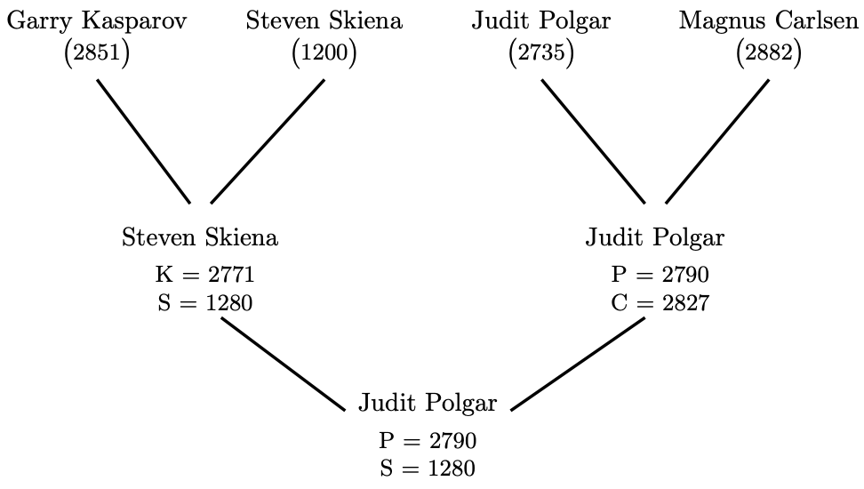
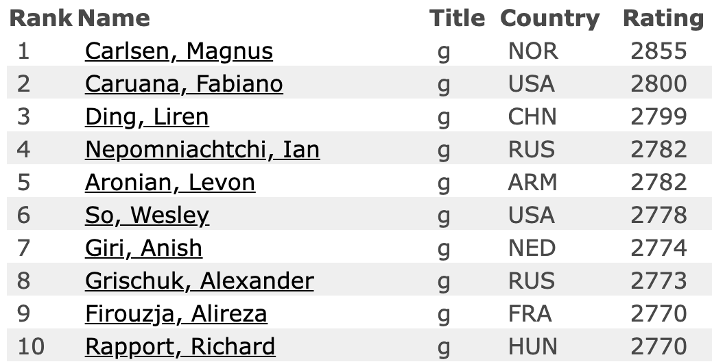

```{r,setup, include=FALSE}
library(knitr)
hook_output = knit_hooks$get('output')
knit_hooks$set(output = function(x, options) {
  # this hook is used only when the linewidth option is not NULL
  if (!is.null(n <- options$linewidth)) {
    x = knitr:::split_lines(x)
    # any lines wider than n should be wrapped
    if (any(nchar(x) > n)) x = strwrap(x, width = n)
    x = paste(x, collapse = '\n')
  }
  hook_output(x, options)
})

knitr::opts_chunk$set(cache = FALSE, message = FALSE,
                      linewidth = 50)
```

## Lecture Objectives

  - Understand the purpose of scores and rankings, and give examples
  - Recognize good scoring functions
  - Explain Arrow's Impossibility Theorem

## Motivation

  - For the first half of the semester, we focused on describing data.
    + Summary statistics and visualization
  - For the second half, we will focus on analyzing data.
  
## Quick detour: Supervised vs Unsupervised Learning

  - Broadly speaking, machine learning is divided into two main branches:
    + **Unsupervised Learning**
    + **Supervised Learning**
  - Unsupervised learning is when we have a multidimensional dataset and try to extract important features
    + Clustering
    + Dimension reduction
  - Supervised learning is when we want to predict a variable given a set of features
    + Regression
    + Classification

## Scores & Rankings

  - **Scoring functions** are measures that reduce multidimensional data to a single value, to highlight a *particular property*.
    + Related to dimension reduction (i.e. unsupervised learning).
  - A **ranking** is a way to order observations.
    + You can order observations based on their scores.
    
## Exercise

\begin{center}

Can you give examples of scores?
    
\end{center}

## Example: Grades

  - Grades reduce your knowledge and learning abilities to a single number, and so they are an example of a scoring function.
  - As with many scoring functions, we have the following three properties:
    + (Some) **arbitrariness**: a different test or a different teacher would lead to different grades.
    + **No validation data**: There is no *correct* grade for a given student.
    + **Robustness**: Students tend to have similar grades in similar classes.

## Example: R-score

  - In some schools, the class average is used to generate a different score.
  - For example, the Z-score measures how many standard deviations above or below the class average a grade is.
    + The higher the Z-score, the higher the GPA
  - The R-score incorporates information about the overall strength of the class.
    + For the same Z-score, the stronger the class, the higher the R-score (and GPA).
  - Grades, Z-scores, and R-scores all try to summarize the same attributes of a student, but in different ways (and with different consequences).

## Example: WAR {.allowframebreaks}

  - WAR: **Wins Above Replacement**.
  - Used in baseball (mostly) and other sports to compare players across different positions, teams, and historical eras.
    + E.g. Who was better, Babe Ruth or Mickey Mantle?
  - The idea is as follows:
    + Summarize a player's attribute into the number of games it win
    + Make adjustments for home field, era, position, etc.
    + Compare to the same score but for a player coming in from the minor league (i.e. the replacement).
  - The higher the score, the better the player.
  - **Remember**: There is some arbitrariness, and indeed there are many different flavours of WAR
  - On Baseball-Reference.com:
    + Mickey Mantle: 110.2 career WAR
    + Babe Ruth: 183.1 career WAR
  - Even though they played in different eras, and at different positions, according to WAR Ruth > Mantle.

## Scores and Supervised Learning

  - Scores are typically functions of other variables.
    + E.g. BMI is weight/height^2^
  - You could technically try to re-learn the scores using machine learning.
    + Rarely useful; only useful if computing the scores in the first place is expensive or difficult.
  - For this reason, we typically see scores as covariates/features in supervised learning.
  
## Developing Scoring Systems {.allowframebreaks}

  - Good scoring functions should have (some of) the following properties:
    + Easy to compute
    + Easy to understand
    + Monotonic interpretation of variables
    + Satisfactory results on outliers
    + Use normalized variables
  - *Monotonic interpretation*: Increasing the underlying variables should change the score in the same direction (either increasing or decreasing).
    + E.g. In the Z-score, a higher grade leads to a higher score.
  - *Outliers*: You want outliers for the score to match outliers in terms of the underlying attributes.
    + E.g. A very high WAR should match a player with a lot of runs, a high batting average, etc.
  - In the presence of a **gold standard** (a variable we trust is correct and reflects the scoring goal, e.g. disease diagnosis), we can create a scoring function by developing a prediction model for the gold standard.
  - When we only have **proxies** (i.e. quantities correlated with the scoring goal), we can still use them to test the validity of our scores.

## Normalization and Z-score {.allowframebreaks}

  - Normalizing variables makes it easier to understand the distribution of the data.
  - There are two very common ways of normalizing a set $X_1, \ldots, X_n$.
    + Z-score: $\tilde{X}_i = (X_i - \bar{X})/S_X$, where $\bar{X}$ is the sample mean, $S_X$ is the sample standard deviation.
    + Min-max: $\tilde{X}_i = (X_i - \min(X))/(\max(X) - \min(X))$, where $\max(X),\min(X)$ are the maximum and minimum for all observations.
  - One important advantage of using normalized variables is that you can construct a scoring function by using a weighted sum of your normalized variables.
  - You still need to find good weights, but this can be done with some trial and error.
  - **Important**: Z-score is only really useful with symmetric, approximately normal data. With skewed data, using min-max scaling, or transform the data first (e.g. log-income instead of income).
    
## Example: FEV {.allowframebreaks}

  - FEV: Forced Expiratory Volume
  - Measures the volume of air expelled by force from your lungs for a given time period (e.g. 5 seconds).
  - Useful in adults for determining loss of pulmonary capacity.
    + Or in athletes, it correlates with performance.
  - We will use a dataset of FEV on *children*. The data can be found on UM Learn.
  
```{r}
library(tidyverse)

data_fev <- read_csv("FEV.csv")
```

```{r}
# FEV vs Age
data_fev |> 
  ggplot(aes(x = age, y = fev)) +
  geom_point()
```

```{r}
# FEV vs height
data_fev |> 
  ggplot(aes(x = height, y = fev)) +
  geom_point()
```

  - In order to be able to compare and rank children of different age, we should probably account for height.
  - Given our graph, the relationship between FEV and height is probably quadratic.
  
```{r}
# Create new FEV score
data_fev <- data_fev |> 
  mutate(fev2 = fev/height^2)

# FEV2 vs Age
data_fev |> 
  ggplot(aes(x = age, y = fev2)) +
  geom_point()
```

```{r}
data_fev |> 
  summarise(cor(age, fev), cor(age, fev2))
```

  - If the goal is compare pulmonary function for children of different age, `fev2` is better than `fev`, because the correlation isn't as strong.
  - However, there is still moderate correlation, and therefore we would probably want a more complex scoring function.

## Rankings {.allowframebreaks}

  - **Rankings** are permutations of the data, typically constructed by sorting the output of a scoring system.
  - Examples include:
    + Standings in sports
    + FIFA rating of international teams
    + Maclean's ranking of universities
    + Google PageRank (see next lecture)
  - So are scores and rankings just interchangeable? *It depends.*
  - Rankings can help give context to a score.
    + Is a 118 career WAR any good?
  - Rankings can mask small differences in scores.
  - Well-designed scores tend to have a normal distribution. 
    + Small differences near the average score could lead to large difference in rankings. 
    + Small differences in the top/bottom rankings can correspond to large differences in scores.
  - A good score shouldn't have too many ties, otherwise the ranking becomes meaningless.
  - **Conclusion**: You should see scores and rankings as complementary.

## Example: Elo {.allowframebreaks}

  - The **Elo rating** is a way to rank the skill of players in chess and other games. 
    + E.g. Individual sports, such as tennis, boxing, but also team sports, such as basketball and football.
  - After each game, the ratings are updated:
  
$$ r^\prime(A) = r(A) + k(S_A - \mu_A).$$

  - Here, we have
    + $r(A)$ is the rating before the game, $r^\prime(A)$ is the rating after.
    + $k > 0$ is a parameter of our choice.
    + $S_A$ is the result of the game (e.g. $S_A = 1$ for a win and $S_A = -1$ for a loss)
    + $\mu_A$ is the *expected* result of the game.
  - When a player wins, their rating goes up, and when they lose, their rating goes down.
  - We define $\mu_A$ as follows:
  
$$ \mu_A = 1 \cdot P(A \mbox{ beats } B) + (-1) \cdot P(B \mbox{ beats } A).$$

  - Therefore, to complete the rating system, we need a way to determine these probabilities.
  - **Main idea**: given players A and B, the probability of a player winning the game should be a function of the *difference* in Elo ratings. 
    + E.g players with ratings 1000 and 1200 should receive the same winning probabilities as players with ratings 1800 and 2000.
  - These probabilities are computed using the **logit function**:
  
$$ \mu_A = \frac{1}{1 + \exp(C \cdot (r(A) - r(B)))}.$$

  - We will come back to this function when we discuss logistic regression.
  - **Note**: The constant $C$ is yet another parameter. This one can be tuned using past results so that the winning probabilities are well-calibrated.
  
```{r, echo = FALSE}
library(tidyverse)
library(cowplot)

data.frame(
  diff = seq(-400, 400, length.out = 100)
) |> 
  mutate(prob = (1 + 10^(-diff/400))^-1) |> 
  ggplot(aes(x = diff, y = prob)) + 
  geom_line() + 
  theme_minimal_grid() +
  xlab(expression(r(A) - r(B))) +
  ylab("P(A beats B)") +
  ylim(c(0, 1))
```
  


  - After each game, the ratings are recalculated.
  - If the difference in rating is overwhelming, and the strong player wins, then the ratings stay the same (i.e. the adjustment is essentially 0).
  - **Conclusion**: Elo is a *scoring system* based on pairwise comparisons of players. It also used to rank the players by strength.
  


## Merging rankings

  - Let's suppose we have multiple scoring systems, leading to different rankings.
    + How can we *combine* the rankings into a single ranking?
  - **Borda's method** is a simple approach.
  - Main idea: give a cost/weight to each of the positions in the ranking. For all items, add up their weights across all rankings. This is the consensus score, that is then used for the consensus ranking.
  
## Example {.allowframebreaks}

  - Suppose we have 5 items (A, B, C, D, E) ranked using 4 scoring systems.
  
|   | Score 1 | Score 2 | Score 3 | Score 4 |
|---|:-------:|:-------:|:-------:|:-------:|
| 1 |    A    |    B    |    A    |    A    |
| 2 |    C    |    A    |    B    |    B    |
| 3 |    B    |    C    |    C    |    D    |
| 4 |    D    |    D    |    E    |    C    |
| 5 |    E    |    E    |    D    |    E    |

  - Next, give a weight of 1 to the first rank, weight of 2 to the second rank, etc.
  - Adding up these weights, we get
    + A: 5, B: 8, C: 12, D: 16, E: 19
  - Our consensus ranking is therefore A, B, C, D, E.
  
## Example: Decathlon

  - In decathlon, athletes compete in 10 track-and-field events.
  - For each event, you can rank the athletes. But how do you aggregate to find the overall winner?
  - Each result for each event receives a score.
    + Track events: the faster the athlete, the higher the score.
    + Field events: the further or higher the result, the higher the score.
  - At the end, all scores are added up. The athlete with the highest score is declared the winner.
  - Each athlete has their specialty, but the winner needs good scores in most events. 

## Arrow's Impossibility Theorem {.allowframebreaks}

  - **Arrow's Impossibility Theorem** says that, in the absence of a gold standard, there exists no *best* ranking system.
  - In other words, there is no way to aggregate rankings/preferences and satisfy the following five properties:
    + *Completeness*: Given two options, you either prefer one of them, or they are equally preferable.
    + *Transitivity*: If you prefer A over B and B over C, you must prefer A over C.
    + If every ranking prefers A over B, then the aggregate should also prefer A over B.
    + *No dictator*: The aggregate cannot depend only on a single ranking.
    + Preference of A over B shouldn't depend on the other candidates.
  - This was originally developed in the context of voting systems.
    + But you can think of each ranking as a voter, and the aggregate as the overall election result.
  - Here's a simple example:
    
| Voter | Red | Green | Blue |
|-------|:---:|:-----:|:----:|
|   A   |  1  |   2   |  3   |
|   B   |  2  |   3   |  1   |
|   C   |  3  |   1   |  2   |

  - Two voters prefer red over green; two voters prefer green over blue.
  - Transitivity would imply that, in aggregate, red should be preferred to blue.
    + But two voters prefer blue over red...
  - **Conclusion**: Correct rankings don't exist. So look for useful rankings.

## Summary

  - Scoring functions are a way to summarise multidimensional data into a single number.
    + With a **gold standard**, we can test the correctness of a scoring system.
    + With a **proxy**, we can assess the correlation between the proxy and the score.
  - Scores can be turned into rankings.
    + Gives context to the scores.
    + But loses some information.
  - Correct rankings don't exist. So look for useful rankings.
