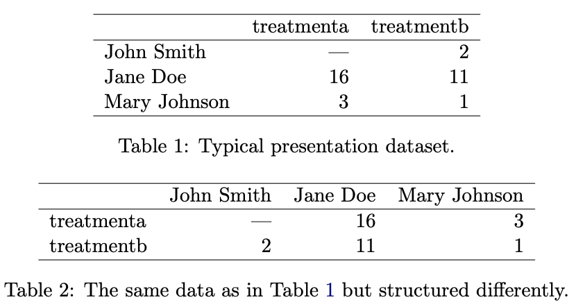
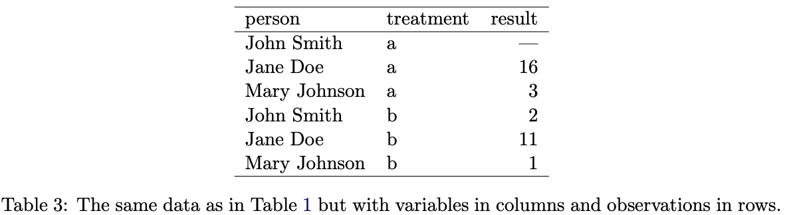
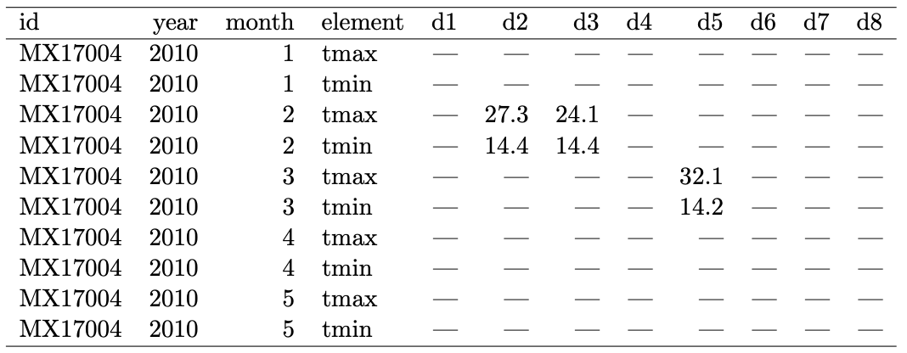
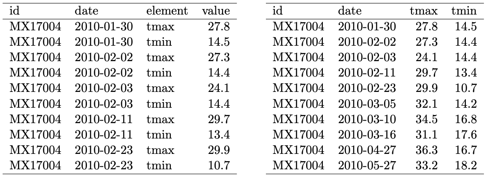
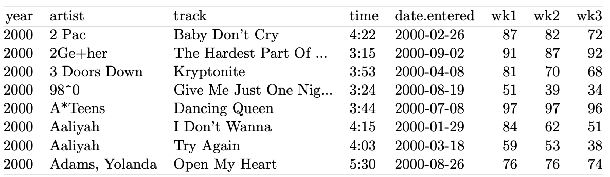
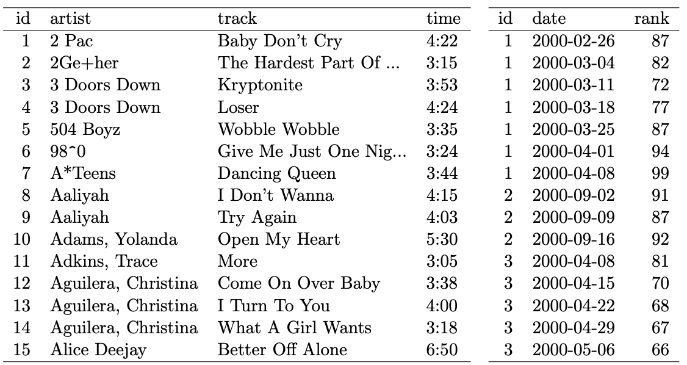

```{r,setup, include=FALSE}
library(knitr)
hook_output = knit_hooks$get('output')
knit_hooks$set(output = function(x, options) {
  # this hook is used only when the linewidth option is not NULL
  if (!is.null(n <- options$linewidth)) {
    x = knitr:::split_lines(x)
    # any lines wider than n should be wrapped
    if (any(nchar(x) > n)) x = strwrap(x, width = n)
    x = paste(x, collapse = '\n')
  }
  hook_output(x, options)
})

knitr::opts_chunk$set(cache = FALSE, message = FALSE,
                      linewidth = 50)
```

## Lecture Objectives

  - Understand the concept of tidy data, and give examples of tidy vs. messy data.
  - Use functions from the `tidyverse` to turn messy data into tidy data.

## Motivation

  - Most datasets need to be transformed before being analyzed.
  - **Tidy data** is a framework that allows you to:
    + Visualize, summarize, and analyze data effectively.
    + Follow a set of principles and understand *how* you should transform your data.
  - The concept is general, but it is a founding principle of the `tidyverse`.
  
## Definition

  - Reference: Wickham (2014), "Tidy Data". *Journal of Statistical Software*.
  - **Tidy data** should follow three principles:
    + Each variable forms a column.
    + Each observation forms a row.
    + Each type of observational unit forms a table.
  - This is related to Codd's third normal form (see COMP 3380)

## Example {.allowframebreaks}





## Why is this important?

  - It makes it easier to summarize.
    + E.g. By having `treatment` as a column, we can group by `treatment` and compute the average `result`.
  - As we'll see in a few weeks, it also makes it easier to visualize and analyze the data.
  - Finally, it is also helpful to have a consistent way of representing data.
    + Easier to write reusable code.
    
## What can go wrong?

  - Wickham (2014) highlights five ways in which data can be messy:
    + Column headers are values, not variable names.
    + Multiple variables are stored in one column.
    + Variables are stored in both rows and columns.
    + Multiple types of observational units are stored in the same table.
    + A single observational unit is stored in multiple tables.
  - We'll go over each of them and explain how to address them in `R`.
  
## Tabular data {.allowframebreaks}

  - **Tabular data** (or tabulated data) is a very common way of presenting data.
    + E.g. You have two variables (major and year) and each cell represent the number of observations of a given major and given year.
  - Although it is useful summary, it is **not** a tidy format.
  - **Why?** Because one variable is spread across multiple columns.
  - Let's look at an example from `mtcars`. The columns correspond to the number of gears.

\vspace{1cm}

```{r, echo = FALSE}
cat("Number of cars by number of cylinders and gears")
janitor::tabyl(mtcars, cyl, gear)
```

\vspace{2in}

  - Now here's the same data but in tidy format.
  
```{r}
library(tidyverse)

mtcars |> 
  count(cyl, gear)
```

## Pivoting

  - How do we turn tabular data into tidy data? By pivoting our dataset.
  - There are two types of pivoting:
    + **Pivoting long**: Pivot the column names to values.
    + **Pivoting wide**: Pivot values into column names.
  - In other words:
    + Pivot long to go from tabular to tidy.
    + Pivot wide to go from tidy to tabular.

## Example {.allowframebreaks}

```{r}
library(tidyverse)
# Create test dataset
dataset <- tribble(
  ~cyl, ~"3", ~"4", ~"5",
  4, 1, 8, 2,
  6, 2, 4, 1,
  8, 12, 0, 2
)
```

```{r}
dataset
```

```{r}
# Pivot long-from tabular to tidy
dataset |> 
  pivot_longer(cols = c(`3`, `4`, `5`),
               names_to = "gear",
               values_to = "count")
```

## Example of pivot wide {.allowframebreaks}

  - How could we create the tabular data in the first place?
    + First, count the number of observations.
    + Then, pivot wide.
    
```{r}
library(tidyverse)

mtcars |> 
  group_by(cyl, gear) |> 
  summarise(count = n()) |> 
  pivot_wider(names_from = "gear",
              values_from = "count")
```

  - As you can see, there was a missing value: there is no car with 8 cylinders and 4 gears. But we know this should simply be zero.


```{r}
# Group by cyl, gear
# Use summarise to count
# Then pivot wide

mtcars |> 
  group_by(cyl, gear) |> 
  summarise(count = n()) |> 
  pivot_wider(names_from = "gear",
              values_from = "count", 
              values_fill = 0) # Fill missing with 0
```

## Exercise

Tidy the simple data frame below. Do you need to make it wider or longer? What variables are you pivoting?

```{r}
preg <- tribble(
  ~pregnant, ~male, ~female,
  "yes",     NA,    10,
  "no",      20,    12
)
```

## Solution {.allowframebreaks}

  - You need to make it *longer*, so that the values `male` and `female` can be stored in cells.

```{r}
preg |> 
  pivot_longer(cols = c("male", "female"),
               names_to = "sex",
               values_to = "count")
```

## Multiple variables in one column

  - Some columns may in fact include two (or more) variables.
    + E.g. In tabular data, socio-demographic subgroups may contain sex and age information
    + `M20-29`, `F20-39`, etc.
  - **Solution**: Separate the values into different columns
  - Note: Often these values are column names, and so a first step may be to pivot the data long.
  
## Example {.allowframebreaks}

  - To do this, the `tidyverse` provides the very convenient function `separate()`.
  - Let's look at an example, where `rate` contains both cases and population information.
  
```{r}
library(tidyverse)
dataset <- tribble(
  ~country, ~year, ~rate,             
  "Afghanistan", 1999,  "745/19987071",     
  "Afghanistan", 2000,  "2666/20595360",    
  "Brazil",      1999,  "37737/172006362",  
  "Brazil",      2000,  "80488/174504898",  
  "China",       1999,  "212258/1272915272",
  "China",       2000,  "213766/1280428583"
)
```

```{r}
dataset |> 
  separate(rate, into = c("cases", "population"))
```

  - By default, splitting occurs at any non-alphanumeric character
    + E.g. / , . - | 
  - You can also specify explicitly at which character the splitting should occur.
  - You can also specify whether the splitted values should be converted (when possible).
  
```{r}
dataset |> 
  separate(rate, into = c("cases", "population"),
           sep = "/", convert = TRUE)
```

## Exercise

Pivot the following dataset long, and then separate sex and age information from the column names.

*Hint*: Look at the help page for `separate()`, under the `sep` argument. What happens if `sep` is a numeric?

```{r}
dataset <- tribble(
  ~Country, ~m014, ~m1524, ~f014, ~f1524,
  "USA", 2, 4, 4, 6,
  "France", 52, 228, 183, 149
)
```

## Solution {.allowframebreaks}

```{r}
# Socio-demographic variable -> socio
# Cell values -> value (don't know what they represent)
dataset |> 
  pivot_longer(cols = c("m014", "m1524", 
                        "f014", "f1524"),
               names_to = "socio", 
               values_to = "value") |> 
  separate(socio, into = c("sex", "age"),
           sep = 1)
```


## Variables are stored in rows and columns {.allowframebreaks}

  - This is probably the most complicated type of untidy data.
  - Because variables are stored in columns, we need to pivot long.
  - But if variable names also appear in cells, we'll need to pivot wide
  



## Example {.allowframebreaks}

```{r}
dataset <- tribble(
  ~Country, ~Stat, ~Y2020, ~ Y2021,
  "Nigeria", "GDP", 400, 450,
  "Nigeria", "Debt", 1200, 1300,
  "Bangladesh", "GDP", 350, 400,
  "Bangladesh", "Debt", 100, 150
)

dataset
```

```{r}
dataset |> 
  pivot_longer(cols = c("Y2020", "Y2021"),
               names_to = "year", values_to = "value") |> 
  pivot_wider(names_from = "Stat", values_from = "value")
```

## Multiple types in same dataset {.allowframebreaks}

  - The example below contains values in the column names



  - But if you tidy it, then information about each track is repeated.
    + Year, artist, track, time, date.entered.
  - A better strategy is to keep the track information and Billboard information *in separate datasets*.
    + Leads to easier maintenance.
  - Once we're ready to analyze, we can join them back (more on this next week).
  



## One type in multiple tables

  - The opposite of the previous setup.
  - For example, you receive an Excel file, where each spreadsheet has the same data but for different years.
  - **Solution**: Load each spreadsheet, add a variable (e.g. year) and "stack" the data frames.
  
## Example {.allowframebreaks}

```{r}
# First year of data
data_year1 <- tribble(
  ~Country, ~sex, ~value,
  "USA", "male", 2, 
  "USA", "female", 4,
  "France", "male", 52,
  "France", "female", 183
)
```

```{r}
# Second year of data
# Note: column names are different!
data_year2 <- tribble(
    ~Country, ~sex, ~score,
  "USA", "male", 4, 
  "USA", "female", 6,
  "France", "male", 228,
  "France", "female", 149
)
```

```{r}
# First change name, then
# create new variable
data_year1 <- data_year1 |> 
  rename(score = value) |> # old = new
  mutate(year = 1)

data_year2 <- data_year2 |> 
  mutate(year = 2)
```


```{r}
# Then stack them
bind_rows(data_year1, data_year2)
```

## Summary

  - We learned about tidy data:
    + Each variable has its own column
    + Each observation has its own row
    + Each value has its own cell
  - Tidy data is about efficient data analysis
    + It's not necessarily the most memory efficient way of storing data...
  - Not all `R` functions are meant to be used with tidy data
    + But the tidyverse (and `tidymodels`) is optimized for it.
